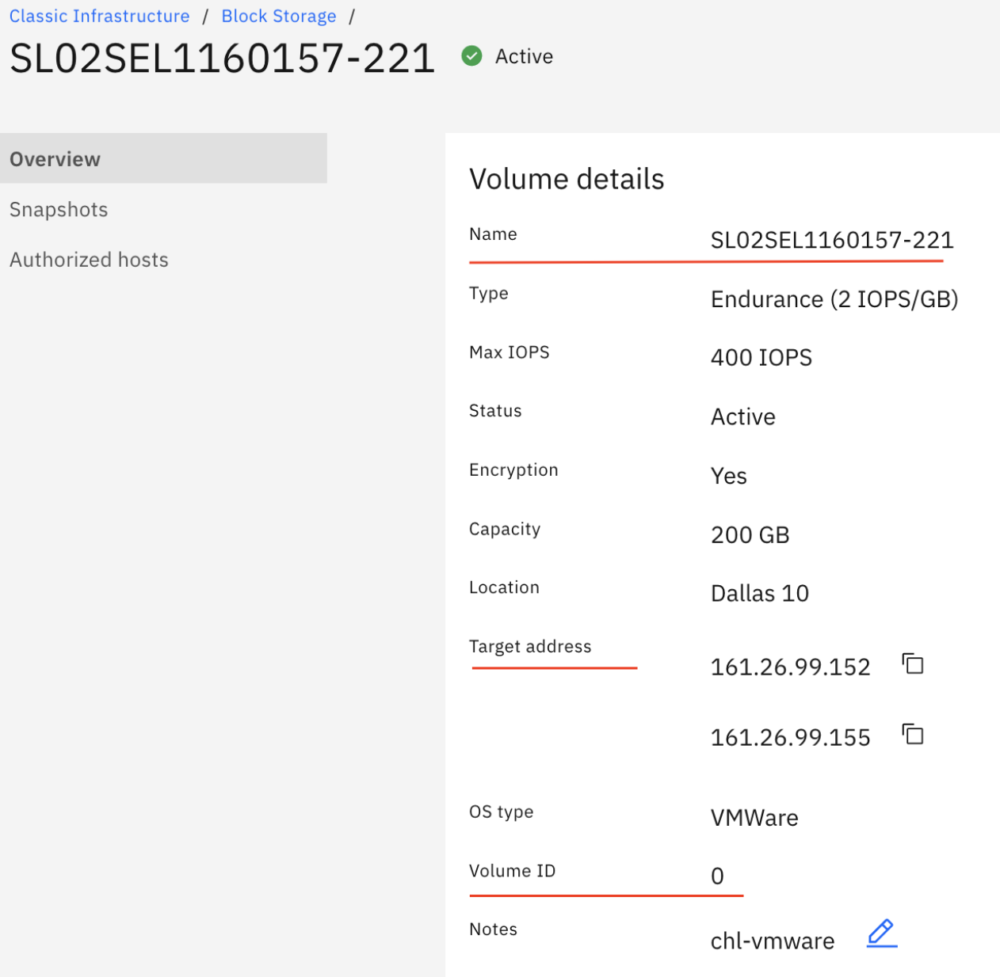

---

copyright:
  years: 2021, 2022
lastupdated: "2022-03-09"

keywords: Block Storage, LUN, volume ID,

subcollection: BlockStorage

---
{:external: target="_blank" .external}
{:tip: .tip}
{:note: .note}
{:important: .important}
{:codeblock: .codeblock}
{:pre: .pre}
{:shortdesc: .shortdesc}
{:ui: .ph data-hd-interface='ui'}
{:cli: .ph data-hd-interface='cli'}
{:api: .ph data-hd-interface='api'}


# Identifying LUNs from the Host OS
{ #identifyLUNfomHostOS}

Various reasons exist for why you would want to look up the LUN ID of the attached storage volumes on the Compute host. For example, you migth have multiple storage devices mounted on the same host with the same volume sizes and you want to detach and decommission one of them but you are not quite sure how to correlate what you see on your Linux&reg; host with what you see in the console. Another example could be that you have multiple {{site.data.keyword.blockstorageshort}} volumes attached to an esxi server and you want to expand the volume size of one of the LUN, and you need to know the correct LUN ID of the storage that you want to expand to do that.

## Linux&reg;
{ #identifyLUNLin}


## Windows&reg;
{ #identifyLUNWin}


## VMWare&reg;
{ #identifyLUNfVMware}

1. Run the `esxcli storage vmfs extent list` command. The output includes the volume name `iscsi-datastore` and its unique Network Addressing Authority (naa)identifier. That number is guaranteed to be unique to that LUN.

   ```text
   Volume Name        VMFS UUID                            Extent Number  Device Name                           Partition
   -----------------  -----------------------------------  -------------  ------------------------------------  ---------
   datastore1         5f69774e-f1031e44-7bdb-ac1f6bc4b812              0  naa.600062b2049d040026fc1e4b2f305682          3
   iscsi-datastore    621f425f-0dc2da8a-927b-ac1f6bc4b812              0  naa.600a098038305674695d51694b427849          1
   ```

2. Next, enter the `esxcfg-mpath -b` command. The output contains the same `naa` number, the LUN ID and the PortalTag.

   ```text
   naa.600a098038305674695d51694b427849 : NETAPP iSCSI Disk (naa.600a098038305674695d51694b427849)
      vmhba64:C0:T1:L0 LUN:0 state:active iscsi Adapter: iqn.2020-10.com.ibm:sl02su1160157-h1907004  Target: IQN=iqn.1992-08.com.netapp:stfdal1007 Alias= Session=00023d000001 PortalTag=1034
      vmhba64:C1:T1:L0 LUN:0 state:active iscsi Adapter: iqn.2020-10.com.ibm:sl02su1160157-h1907004  Target: IQN=iqn.1992-08.com.netapp:stfdal1007 Alias= Session=00023d000002 PortalTag=1030
   ```   
   
   In the example, "LUN:0" means the LUN id is 0. 

3. Execute the `esxcli iscsi adapter target portal list` command. From the ouput, note the IP address and Tpgt value that mathes the Portal Tag.

   ```text
   Adapter  Target                             IP             Port  Tpgt
   -------  ---------------------------------  -------------  ----  ----
   vmhba64  iqn.1992-08.com.netapp:stfdal1007  161.26.99.155  3260  1034
   vmhba64  iqn.1992-08.com.netapp:stfdal1007  161.26.99.152  3260  1030
   ```

   In the example, "161.26.99.155" is the target IP address of your {{site.data.keyword.blockstorageshort}} and "1034" is the PortalTag.

4. Next, use the IBMCLOUD CLI command `ibmcloud sl block volume-list`. The output contains the volume ID, the hostname of the storage device, the DC location, storage type, capacity, the amount of space already being used and the LUN ID.

   ```text 
   $ ibmcloud sl block volume-list
   id                      username                   datacenter   storage_type                        capacity_gb   bytes_used   lunId   
   221426384               SL02SEL1160157-195         che01        endurance_block_storage             1500          -            2    
   332299016               SL02SEL1160157-220         dal13        endurance_block_storage             20            -            2   
   333280508               SL02SEL1160157-221         dal10        endurance_block_storage             200           -            0  
   ```

   In the example, "0" is the LUN id and "333280508" is the volume id of your {{site.data.keyword.blockstorageshort}} LUN.

   You can execute `ibmcloud sl block volume-detail` to get more detailed information about the storage volume.

   ```zsh
   $ ibmcloud sl block volume-detail 333280508
   Name                       Value
   ID                         333280508
   User name                  SL02SEL1160157-221
   Type                       endurance_block_storage
   Capacity (GB)              200
   LUN Id                     0
   Endurance Tier             READHEAVY_TIER
   Endurance Tier Per IOPS    2
   Datacenter                 dal10
   Target IP                  161.26.99.155
   # of Active Transactions   0
   Replicant Count            0
   ```

   So you can map the iscsi LUN ID to the block device's hostname:

   ```text
   SL02SEL1160157-221  lun id: 0     Target IP: 161.26.99.155
   ```
   
   Alternatively, you can also view the same information on the Volume Details page in the UI. 

   


