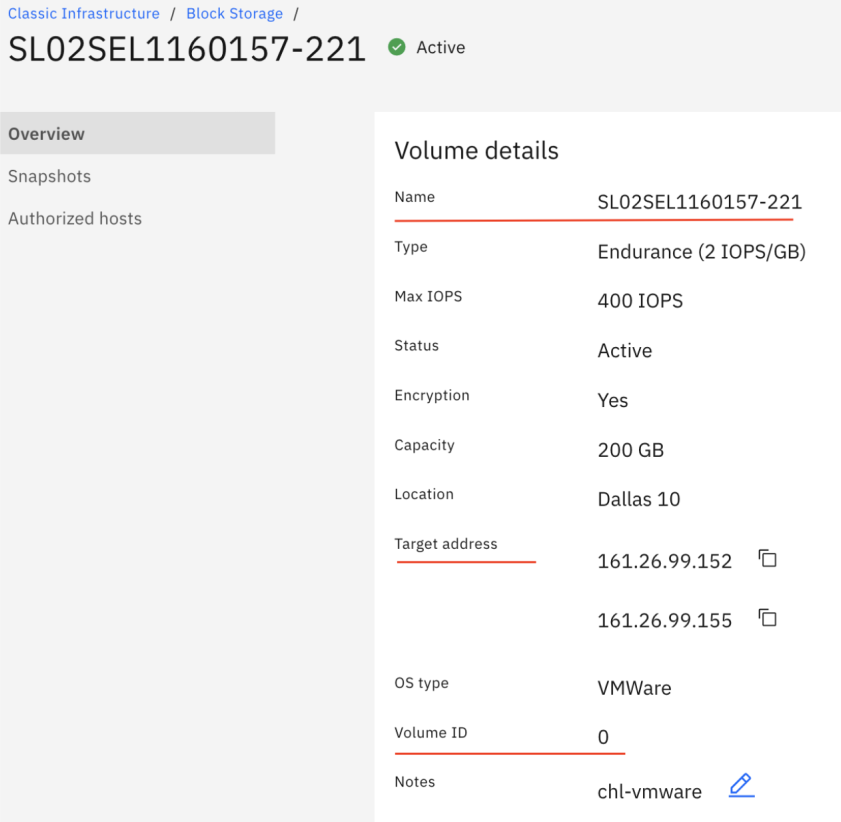

---

copyright:
  years: 2021, 2022
lastupdated: "2025-03-19"

keywords: Block Storage for Classic, LUN, volume ID,

subcollection: BlockStorage

---
{{site.data.keyword.attribute-definition-list}}


# Identifying LUNs
{: #identifyLUN}

Various reasons exist for why you would want to look up the LUN ID of the attached storage volumes on the Compute host. For example, you might have multiple storage devices that are mounted on the same host with the same volume sizes. You want to detach and decommission one of them. However, you are not sure how to correlate what you see on your Linux&reg; host with what you see in the console. Another example might be that you have multiple {{site.data.keyword.blockstorageshort}} volumes that are attached to an ESXi server. You want to expand the volume size of one of the LUNs, and you need to know the correct LUN ID of the storage to do that. {: shortdesc}

## Viewing the LUN ID in Linux&reg;
{: #identifyLUNLin}
{: support}

1. In the command line, run `multipath -ll` and look at the output.

   ```sh
   root@server:~# multipath -l
   3600a098038303845372b4a5232346e35 dm-0 NETAPP ,LUN C-Mode
   size=12T features='4 queue_if_no_path pg_init_retries 50 retain_attached_hw_handle' hwhandler='1 alua' wp=rw
   -+- policy='round-robin 0' prio=50 status=active
   - `1:0:0:0 sdc 8:32 active ready running`
   3600a098038304471562b4c4743384332 dm-1 NETAPP ,LUN C-Mode
   size=12T features='4 queue_if_no_path pg_init_retries 50 retain_attached_hw_handle' hwhandler='1 alua' wp=rw
   -+- policy='round-robin 0' prio=10 status=active
   `- 3:0:0:1 sdd 8:48 active ready running`
   ```
   {: screen}

   Note "1:0:0:0" and "3:0:0:1". The last digits in each of these fields "1:0:0:0" and "3:0:0:1", the "0" and "1" are the iscsi LUN ID numbers of your block storage devices.

2. Enter the following ibmcloud cli commands: `ibmcloud sl block volume-list` and `ibmcloud sl block volume-detail` to compare their outputs to the information that you collected in Step 1.

   ```sh
   $ ibmcloud sl block volume-list
   id       username          datacenter storage_type              capacity_gb bytes_used lunId
   20973781 IBM02SEL1575811-1 dal09      endurance_block_storage   100           -          3
   22030583 IBM02SEL1575811-3 dal12      endurance_block_storage   20            -          0
   23976093 IBM02SEL1575811-4 dal12      performance_block_storage 80            -          1
   24024217 IBM02SEL1575811-5 seo01      performance_block_storage 2000          -          2
   ```
   {: screen}

   ```sh
   $ ibmcloud sl block volume-detail 22030583
   Name                       Value
   ID                         22030583
   User name                  IBM02SEL1575811-3
   Type                       endurance_block_storage
   Capacity (GB)              20
   LUN Id                     0
   Endurance Tier             READHEAVY_TIER
   Endurance Tier Per IOPS    2
   Datacenter                 dal12
   Target IP                  161.26.110.17
   Snapshot Size (GB)         5
   Snapshot Used (Bytes)      3325952
   # of Active Transactions   0
   Replicant Count            0
   ```
   {: screen}

   The output shows the hostname of the storage device, the LUN ID, and the Target IP:

   ```text
   IBM02SEL1575811-3 lun id: 0 Target IP: 161.26.110.17
   IBM02SEL1575811-4 lun id: 1 Target IP: 161.26.110.43
   ```
   {: screen}

3. You can further confirm this information by using the following command `iscsiadm -m session -P 3`.

   ```sh
   # iscsiadm -m session -P 3
   iSCSI Transport Class version 2.0-870
   version 6.2.0.874-7
   Target: iqn.1992-08.com.netapp:stfdal1201 (non-flash)
   Current Portal: 161.26.110.17:3260,1027 # match this target iscsi IP to the block storage device
   Persistent Portal: 161.26.110.17:3260,1027
   **********
   Interface:
   **********
   Iface Name: default
   Iface Transport: tcp
   Iface Initiatorname: iqn.2018-08.com.ibm:ibm02su1575811-i117305979
   Iface IPaddress: 10.74.10.67
   Iface HWaddress: <empty>
   Iface Netdev: <empty>
   SID: 1
   iSCSI Connection State: LOGGED IN
   iSCSI Session State: LOGGED_IN
   Internal iscsid Session State: NO CHANGE
   *********
   Timeouts:
   *********
   Recovery Timeout: 5
   Target Reset Timeout: 30
   LUN Reset Timeout: 30
   Abort Timeout: 15
   *****
   CHAP:
   *****
   username: IBM02SU1575811-I117305979
   password: ********
   username_in: <empty>
   password_in: ********
   ************************
   Negotiated iSCSI params:
   ************************
   HeaderDigest: None
   DataDigest: None
   MaxRecvDataSegmentLength: 262144
   MaxXmitDataSegmentLength: 65536
   FirstBurstLength: 65536
   MaxBurstLength: 65536
   ImmediateData: Yes
   InitialR2T: No
   MaxOutstandingR2T: 1
   ************************
   Attached SCSI devices:
   ************************
   Host Number: 1 State: running
   scsi1 Channel 00 Id 0 Lun: 0 # match the "Lun: 0" here to the LUN ID.
   Attached scsi disk sdc State: running

   Current Portal: 161.26.110.43:3260,1041 # match this target iscsi IP to the block storage device.
   Persistent Portal: 161.26.110.43:3260,1041
   **********
   Interface:
   **********
   Iface Name: default
   Iface Transport: tcp
   Iface Initiatorname: iqn.2018-08.com.ibm:ibm02su1575811-i11730597
   Iface IPaddress: 10.74.10.67
   Iface HWaddress: <empty>
   Iface Netdev: <empty>
   SID: 3
   iSCSI Connection State: LOGGED IN
   iSCSI Session State: LOGGED_IN
   Internal iscsid Session State: NO CHANGE
   *********
   Timeouts:
   *********
   Recovery Timeout: 5
   Target Reset Timeout: 30
   LUN Reset Timeout: 30
   Abort Timeout: 15
   *****
   CHAP:
   *****
   username: IBM02SU1575811-I117305979
   password: ********
   username_in: <empty>
   password_in: ********
   ************************
   Negotiated iSCSI params:
   ************************
   HeaderDigest: None
   DataDigest: None
   MaxRecvDataSegmentLength: 262144
   MaxXmitDataSegmentLength: 65536
   FirstBurstLength: 65536
   MaxBurstLength: 65536
   ImmediateData: Yes
   InitialR2T: No
   MaxOutstandingR2T: 1
   ************************
   Attached SCSI devices:
   ************************
   Host Number: 3 State: running
   scsi3 Channel 00 Id 0 Lun: 1 # match the "Lun: 1" here to the LUN ID.
   Attached scsi disk sdd State: running
   ```
   {: screen}

## Viewing the LUN ID in Windows
{: #identifyLUNWin}
{: support}

1. In PowerShell, issue the command `iscsicli SessionList| findstr /c:"Device Number" /c:"Location"  /c:"Target Portal"`. The output shows the IP address and the LUN ID. In the example, the IP address is 10.201.174.123 and the LUN ID is LUN 0.

   ```powershell
   C:\Users\Adminisitrator>iscsicli SessionList| findstr /c:"Device Number" /c:"Location"  /c:"Target Portal"
      Target Portal    : 10.201.174.124/3260
      Device Number    : 3
      Location         : Bus Number 0, Target Id O, LUN 0
      Target Portal    : 10.201.174.123/3260
      Device Number    : 4
      Location:        : Bus Number 0, Target ID 1, LUN 0
   ```
   {: screen}

2. Then, enter the following ibmcloud cli commands: `ibmcloud sl block volume-list` and `ibmcloud sl block volume-detail` to compare their outputs to the information that you collected in Step 1.

   ```sh
   $ ibmcloud sl block volume-list
   id        username           datacenter storage_type            capacity_gb bytes_used lunId
   333280508 SL02SEL1160157-221 dal10      endurance_block_storage 200         -          0
   333506786 SL02SEL1160157-222 tok02      endurance_block_storage 200         -          0
   ```
   {: screen}

   ```sh
   $ ibmcloud sl block volume-detail 333506786
   Name                       Value
   ID                         333506786
   User name                  SL02SEL1160157-222
   Type                       endurance_block_storage
   Capacity (GB)              200
   LUN Id                     0
   Endurance Tier             READHEAVY_TIER
   Endurance Tier Per IOPS    2
   Datacenter                 tok02
   Target IP                  10.201.174.123
   # of Active Transactions   0
   Replicant Count            0
   ```
   {: screen}

## Viewing the LUN ID in VMWare&reg;
{: #identifyLUNVMware}
{: support}

1. Run the `esxcli storage vmfs extent list` command. The output includes the volume name `iscsi-datastore` and its unique Network Addressing Authority (`naa`) identifier. That number is guaranteed to be unique to that LUN.

   ```sh
   Volume Name     VMFS UUID                           Extent Device Name                     Partition
                                                       Number
   --------------- ----------------------------------- ------ ------------------------------------ ----
   datastore1      5f69774e-f1031e44-7bdb-ac1f6bc4b812      0 naa.600062b2049d040026fc1e4b2f305682    3
   iscsi-datastore 621f425f-0dc2da8a-927b-ac1f6bc4b812      0 naa.600a098038305674695d51694b427849    1
   ```
   {: screen}

2. Next, enter the `esxcfg-mpath -b` command. The output contains the same `naa` number, the LUN ID, and the PortalTag.

   ```sh
   naa.600a098038305674695d51694b427849 : NETAPP iSCSI Disk (naa.600a098038305674695d51694b427849)
      vmhba64:C0:T1:L0 LUN:0 state:active iscsi Adapter: iqn.2020-10.com.ibm:sl02su1160157-h1907004
      Target: IQN=iqn.1992-08.com.netapp:stfdal1007 Alias= Session=00023d000001 PortalTag=1034
      vmhba64:C1:T1:L0 LUN:0 state:active iscsi Adapter: iqn.2020-10.com.ibm:sl02su1160157-h1907004
      Target: IQN=iqn.1992-08.com.netapp:stfdal1007 Alias= Session=00023d000002 PortalTag=1030
   ```
   {: screen}

   In the example, the string `LUN:0` means that the LUN ID is 0.

3. Issue the `esxcli iscsi adapter target portal list` command. From the output, note the IP address and Tpgt value that matches the Portal Tag.

   ```text
   Adapter  Target                             IP             Port  Tpgt
   -------  ---------------------------------  -------------  ----  ----
   vmhba64  iqn.1992-08.com.netapp:stfdal1007  161.26.99.155  3260  1034
   vmhba64  iqn.1992-08.com.netapp:stfdal1007  161.26.99.152  3260  1030
   ```
   {: screen}

   In the example, the IP address "161.26.99.155" is the target IP address of your {{site.data.keyword.blockstorageshort}} and "1034" is the PortalTag.

4. Next, use the IBMCLOUD CLI command `ibmcloud sl block volume-list`. The output contains the volume ID, the hostname of the storage device, the DC location, storage type, capacity, the amount of space that is already used, and the LUN ID.

   ```text
   $ ibmcloud sl block volume-list
   id        username           datacenter storage_type            capacity_gb bytes_used lunId
   221426384 SL02SEL1160157-195 che01      endurance_block_storage 1500         -          2
   332299016 SL02SEL1160157-220 dal13      endurance_block_storage 20           -          2
   333280508 SL02SEL1160157-221 dal10      endurance_block_storage 200          -          0
   ```
   {: screen}

   In the example, the string "333280508" is the volume ID and "0" is the LUN ID of your {{site.data.keyword.blockstorageshort}} LUN.

   Issue the command `ibmcloud sl block volume-detail` to get more detailed information about the storage volume.

   ```sh
   $ ibmcloud sl block volume-detail 333280508
   Name                       Value
   ID                         333280508
   User name                  SL02SEL1160157-221
   Type                       endurance_block_storage
   Capacity (GB)              200
   LUN Id                     0
   Endurance Tier             READHEAVY_TIER
   Endurance Tier Per IOPS    2
   Datacenter                 dal10
   Target IP                  161.26.99.155
   # of Active Transactions   0
   Replicant Count            0
   ```
   {: screen}

   So you can map the iscsi LUN ID to the block device's hostname:

   ```text
   SL02SEL1160157-221  lun id: 0  Target IP: 161.26.99.155
   ```
   {: screen}

## Viewing the LUN ID in the console
{: #identifyLUNUI}
{: support}

You can also gather the LUN ID, Target IP address, and hostname of the {{site.data.keyword.blockstorageshort}} device on the Volume Details page in the console.

{: caption="The Volume Details page of the console provides detailed information about the LUN." caption-side="bottom"}
