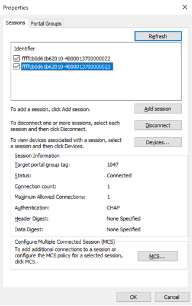
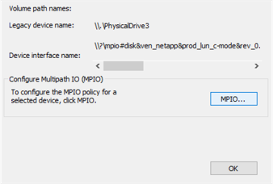

---

copyright:
  years: 2014, 2024
lastupdated: "2024-07-27"

keywords: MPIO iSCSI LUNS, iSCSI Target, MPIO, multipath, block storage, LUN, mounting, mapping secondary storage

subcollection: BlockStorage

content-type: tutorial
services:
account-plan: paid
completion-time: 1h

---
{{site.data.keyword.attribute-definition-list}}

# Mount iSCSI LUNS on Microsoft Windows
{: #mountingWindows}
{: toc-content-type="tutorial"}
{: toc-services=""}
{: toc-completion-time="1h"}

This tutorial guides you through how to mount an {{site.data.keyword.blockstoragefull}} volume on a server with the Windows 2019 operating system. You're going to create two connections from one network interface of your host to two target IP addresses of the storage array.
{: shortdesc}

## Before you begin
{: #authhostwin}
{: step}

If multiple hosts mount the same {{site.data.keyword.blockstorageshort}} volume without being cooperatively managed, your data is at risk for corruption. Volume corruption can occur if changes are made to the volume by multiple hosts at the same time. You need a cluster-aware, shared-disk file system to prevent data loss such as Microsoft Cluster Shared Volumes (CSV), Red Hat Global File System (GFS2), VMware® VMFS, and others. For more information, see your host's OS Documentation.
{: attention}

It's best to run storage traffic on a VLAN, which bypasses the firewall. Running storage traffic through software firewalls increases latency and adversely affects storage performance. For more information about routing storage traffic to its own VLAN interface, see the [FAQs](/docs/BlockStorage?topic=BlockStorage-block-storage-faqs#howtoisolatedstorage).
{: important}

Before you begin, make sure that the host that is to access the {{site.data.keyword.blockstorageshort}} volume is authorized. For more information, see [Authorizing the host in the console](/docs/BlockStorage?topic=BlockStorage-managingstorage&interface=ui#authhostUI){: ui}[Authorizing the host from the CLI](/docs/BlockStorage?topic=BlockStorage-managingstorage&interface=cli#authhostCLI){: cli}[Authorizing the host with Terraform](/docs/BlockStorage?topic=BlockStorage-managingstorage&interface=terraform#authhostTerraform){: terraform}.
{: requirement}

The prerequisites on the iSCSI client include:
- Installation of Multipath-IO services 
- Setting the iSCSI initiator service to start automatically
- Enabling support for multipath MPIO to iSCSI
- Enabling automatic claiming of all iSCSI volumes

It is important to restart the Windows client after installation of these prerequisites. The MPIO load-balancing policy requires a restart so that it can be set.
{: important}

## Installing the MPIO feature
{: #installMPIOWin}
{: step}

1. Start the Server Manager and browse to **Manage**, **Add Features**.
2. Click **Next** to open the Features menu.
3. Scroll down and check **Multipath I/O**.
4. Click **Next** and **Install** to install MPIO on the host server.
   {: caption="Figure 1. Install MPIO on the host server." caption-side="bottom"}
5. Restart the server.

## Adding iSCSI support for MPIO devices
{: #addISCSIWim}
{: step}

1. Open the MPIO Properties window by clicking **Start**, pointing to **Administrative Tools**, and clicking **MPIO**.
2. Click **Discover Multi-Paths**.
3. Select **Add support for iSCSI devices**, and click **Add**.
   
   {: caption="Figure 2. Enable MPIO support for ISCSI devices." caption-side="bottom"}
4. If you're prompted to restart the server, click **Yes**. Otherwise, continue to the next step.

## Configuring the iSCSI Initiator to discover the Target
{: #configISCSIWin}
{: step}

1. From the Server Manager, start iSCSI Initiator, and select **Tools**, **iSCSI Initiator**.
2. Click the **Configuration** tab.
   1. The Initiator Name field might already be populated with an entry similar to `iqn.2024-07.com.ibm:`.
   1. Click **Change** to replace existing values with your iSCSI Qualified Name (IQN)[^IQN].
     
      {: caption="Figure 3. ISCSI Initiator Properties" caption-side="bottom"}
      [^IQN]: The IQN name can be obtained from the **{{site.data.keyword.blockstorageshort}} Detail** screen in the [{{site.data.keyword.cloud_notm}} console](/login){: external}.
   1. Click **Discovery**, and click **Discover Portal**.
     
      {: caption="Figure 4. ISCSI Initiator Properties" caption-side="bottom"}
   1. Input the IP address of your iSCSI target and leave the Port at the default value of 3260.
   1. Click **Advanced** to open the Advanced Settings window.
   1. On the Local adapter list, select Microsoft iSCSI Initiator.
   1. On the Initiator IP list, select the IP address of the host.
   1. On the Target Portal IP list, select the IP of one of the storage interfaces.
   1. Select **Enable CHAP log-on** to turn on CHAP authentication.

      {: caption="Figure 5. Enable CHAP Login in Advanced Settings." caption-side="bottom"}
   1. In the **Name** field, delete any existing entries and input the username from the [{{site.data.keyword.cloud_notm}} console](/login){: external}. This field is case-sensitive.
   1. In the **Target secret** field, enter the password from the [{{site.data.keyword.cloud_notm}} console](/login){: external}. This field is case-sensitive.
   1. Click **OK** on **Advanced Settings** and **Discover Target Portal** windows to get back to the main iSCSI Initiator Properties screen. If you receive authentication errors, check the username and password entries.
3. The name of your target appears in the Discovered targets section with an `Inactive` status. Click **Connect** to connect to the target.

   {: caption="Figure 6. Discovered Target in the ISCSI Initiator Properties window." caption-side="bottom"}
4. Select **Enable multi-path** checkbox to enable multi-path IO to the target.

   {: caption="Figure 7. Enable multi-path IO on the Connect to Target screen." caption-side="bottom"}
5. Click **Advanced**, and select **Enable CHAP log-on**.
   {: caption="Figure 8. CHAP logon and credentials." caption-side="bottom"}
6. Enter the username in the Name[^username] field, and enter the password in the Target secret[^password] field.
   [^username]: The Name and Target secret field values can be obtained from the **{{site.data.keyword.blockstorageshort}} Detail** screen.
   [^password]: The Name and Target secret field values can be obtained from the **{{site.data.keyword.blockstorageshort}} Detail** screen.

7. Click **OK** until the **iSCSI Initiator Properties** window is displayed. The status of the target in the **Discovered Targets** section changes from **Inactive** to **Connected**.

   {: caption="Figure 9. The first discovered target is shown as connected." caption-side="bottom"}

### Adding and configuring multiple MPIO sessions
{: #configmultiMPIOsessions}

1. Start the iSCSI Initiator, and on the Targets tab, click **Properties**.
2. Click **Add Session** on the Properties window.
3. In the Connect to Target dialog box, select **Enable multi-path** checkbox, and click **Advanced**.

   {: caption="Figure 10. Adding a second MPIO path." caption-side="bottom"}
4. In the Advanced Settings window, update the following fields.
   1. On the Local adapter list, select Microsoft iSCSI Initiator.
   1. On the Initiator IP list, select the IP address of the host.
   1. On the Target Portal IP list, select the IP of one of the storage interfaces.
   1. Click **Enable CHAP log-on** checkbox.
   1. Enter the Name and Target secret values that were obtained from the console and click **OK**.
   1. Click **OK** on the Connect To Target window to go back to the Properties window.
5. Click **Properties**. In the Properties dialog box, click **Add Session** again to add the second path.
6. In the Connect to Target window, select the **Enable multi-path** checkbox. Click **Advanced**.
7. In the Advanced Settings window,
   1. On the Local adapter list, select Microsoft iSCSI Initiator.
   1. On the Initiator IP list, select the IP address that corresponds to the host. In this case, you are connecting two network interfaces on the storage array to a single network interface on the host. Therefore, this interface is the same as the one that was provided for the first session.
   1. On the Target Portal IP list, select the IP address for the second interface[^SecondIP] that is enabled on the storage array.
     [^SecondIP]: You can find the second IP address in the **{{site.data.keyword.blockstorageshort}} Detail** screen in the [{{site.data.keyword.cloud_notm}} console](/login){: external}.
   1. Click **Enable CHAP log-on** checkbox.
   1. Enter the Name and Target secret values that were obtained from the console and click **OK**.
   1. Click **OK** on the Connect To Target window to go back to the Properties window.
     
   {: caption="Figure 11. Adding CHAP credentials for the 2nd target in Advanced Settings." caption-side="bottom"}
8. Now the Properties window displays more than one session within the Identifier pane. It means that you have more than one session into the iSCSI storage.
    
   {: caption="Figure 12. Two connected sessions are displayed." caption-side="bottom"}

   If your host has multiple interfaces that you want to connect to the storage, you can set up another connection with the address of the second NIC in the Initiator IP field. However, be sure to authorize the second initiator IP address in the [{{site.data.keyword.cloud}} console](/login){: external} before you attempt to make the connection.
   {: note}

9. In the Properties window, click **Devices** to open the Devices window. The device interface name start with `mpio`.
   
   {: caption="Figure 13. Devices window displays the iSCSI target." caption-side="bottom"}
10. Click **MPIO** to open the **Device Details** window. You can choose load balance policies for MPIO in this window and it shows you the paths to the iSCSI. In this example, two paths are shown as available for MPIO.
   
   {: caption="Figure 14. Multipath can be validated on the Device Details window." caption-side="bottom"}
11. Click **OK** several times to exit the iSCSI Initiator.

## Initializing and formatting the {{site.data.keyword.blockstorageshort}} volume
{: #formatLUNonWIn}
{: step}

1. Press the Windows Logo key + X, and then click **Run**.
2. In the Run dialog box, type `Diskmgmt.msc`. Click **OK**, and the Disk Management dialog box appears. The side pane shows the drives that are attached to your host.
3. In the Disk Management window, right-click the discovered LUN's name, and then click **Online**.
4. Right-click and select **Initialize Disk**.
5. In the dialog box, select the disk to initialize, and then click **OK**.
6. The New Simple Volume wizard starts. Select a disk size, and then click **Next**.
7. Assign a drive letter to the LUN, and then click **Next**.
8. Enter the parameters to format the LUN.
    - On a Windows Server, only NTFS is supported.
    - Set the allocation unit size to 64 K.
    - Provide a label for your Storage volume.
9. Click **Next**.
10. Check the values for your volume, and then click **Finish**. On the Disk Management page, the volume now appears as Online.

## Verifying whether MPIO is configured correctly
{: #verifyMPIOWindows}
{: step}

It's possible to attach {{site.data.keyword.blockstorageshort}} with only a single path, but it is important that connections are established on both paths to ensure no disruption of service. To verify whether Windows MPIO is configured, you must first ensure that the MPIO Add-on is enabled and then restart the server.

{: caption="Figure 15. Multipath I/O is shown as checked." caption-side="bottom"}

After the restart is complete, take the following steps to view all of the active paths.
1. On the desktop, click **Start**.
2. In the Start Search field, type `diskmgmt.msc`.
3. In the Programs list, click `diskmgmt`.
4. Right-click each disk for which you want to verify the multiple paths and then click **Properties**.
5. On the MPIO tab, in the Select the MPIO policy list, click all the paths that are active.
   
   {: caption="Figure 16. Several paths that are leading to the target are shown." caption-side="bottom"}

To verify multipathing by using the command line, complete the following steps.

1. Open the command prompt.
2. Run `mpclaim.exe –v c:\multipathconfig.txt` to capture the multipath configuration.
3. Review the contents of the `multipathconfig.txt`. Confirm that each of the two paths that are listed for the LUN contain distinct TPG_Id values.

If MPIO isn't configured correctly, your storage device might disconnect and appear offline when a network outage occurs or when {{site.data.keyword.cloud}} teams perform maintenance. MPIO ensures an extra level of connectivity during those events, and keeps an established session to the LUN with active read/write operations.

On rare occasions, a LUN is provisioned and attached while the second path is down. In such instances, the host might see one single path when the discovery scan is run. If you encounter this phenomenon, check the [{{site.data.keyword.cloud}} status page](/status?component=block-storage&selected=status){: external} to see whether a current event might impact your host's ability to access the storage. If no events are reported, perform the discovery scan again to ensure that all paths are properly discovered. If an event is in progress, the storage can be attached with a single path. However, it's essential that paths are rescanned after the event is completed. If both paths are not discovered after the rescan, [create a support case](/unifiedsupport/cases/add){: external} so it can be properly investigated.

## Unmounting {{site.data.keyword.blockstorageshort}} volumes
{: #unmountingWin}
{: step}

To disconnect an iSCSI LUN from a Windows-based {{site.data.keyword.cloud}} Compute instance, complete the following steps.

### Disconnect the volume from the iSCSI Initiator
{: #startISCSIwin}

1. In Server Manager, click **Storage** > **iSCSI**. 
1. Right-click the volume and take it **Offline**.
1. In iSCSI Initiator, click **Targets**.
2. Select the target that you want to remove and click **Disconnect**.

### Removing targets
{: #removetargetoptional}

This step is optional, for when you no longer need to access the iSCSI targets.

1. Click **Discovery** in the iSCSI Initiator.
2. Highlight the target portal that is associated with your storage volume and click **Remove**.
