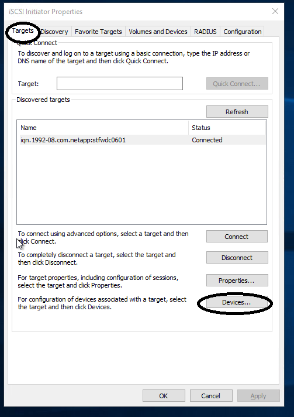
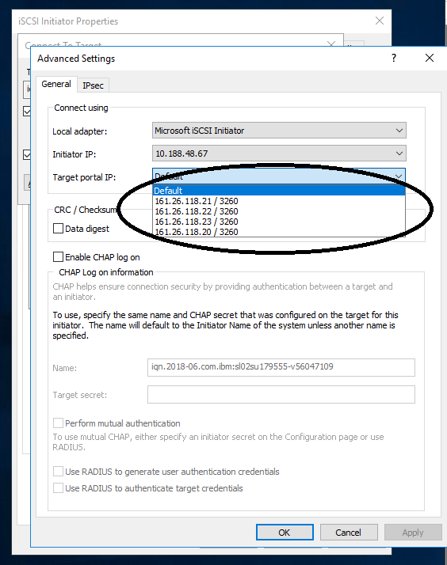
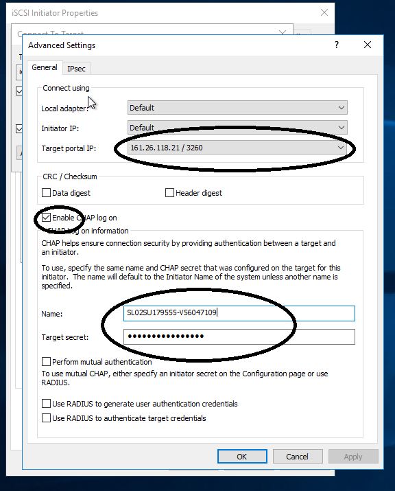
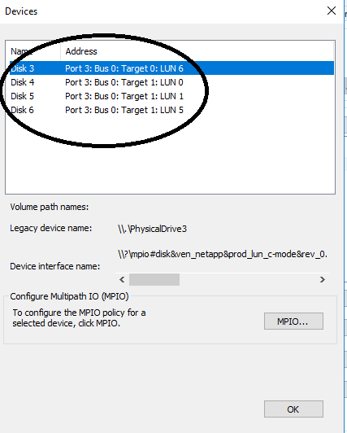
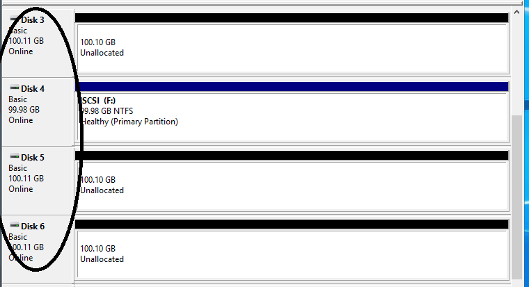

---

copyright:
  years: 2014, 2025
lastupdated: "2025-03-04"

keywords: Block Storage for Classic, auxiliary storage, missing routes, mpio, multipath, windows, troubleshooting

subcollection: BlockStorage

content-type: troubleshoot
---
{{site.data.keyword.attribute-definition-list}}

# Windows 2012 R2 - multiple iSCSI devices
{: #troubleshootingWin12}
{: troubleshoot}
{: support}

Windows Server 2012 R2 reached its end of life on 10 October 10 2023.Microsoft no longer provides security updates, bug fixes, or technical support for this operating system. Migrate your server to a newer version of the operating system, like Windows Server 2022.
{: deprecated}

If you use more than two iSCSI devices with the same host, you might find this procedure useful; especially if all the iSCSI connections are from the same Storage device. When you use more than two devices, but can see only two devices in Disk Manager, then you need to manually connect to each device in iSCSI Initiator on every server node.
{: tsSymptoms}

## Manually connecting storage devices
{: #manualconnect}
{: tsResolve}

1. Open the Windows iSCSI Initiator.
2. On the **Targets** tab, click **Devices**.

   {: caption="The iSCSI Initiator properties are displayed." caption-side="bottom"}
3. Confirm the number of devices that are shown. If you see two devices, instead of the four that were authorized, continue to the next step.
4. Click **Targets**, then **Connect**.
5. Select **Multipath**, then **Advanced**.
6. Select Microsoft iSCSI Initiator as the Local adapter. The Initiator IP belongs to your server.
7. Select the first of the IP addresses that are shown in the Target Portal IP list.

   {: caption="IP addresses are shown in Advanced Settings." caption-side="bottom"}

   You must repeat this step for all the IP addresses that are listed.
   {: tip}

8. Select the **Enable CHAP** box, and enter the server's CHAP ID and Password.

   {: caption="CHAP configuration in Advanced Settings." caption-side="bottom"}
9. Click **OK**.
10. Repeat steps 5-9 for every IP that you entered in the iSCSI Initiator. When you're done, click the **Devices** tab and review the results. Expect to see every volume that you set up listed twice.

    {: caption="Devices." caption-side="bottom"}
11. Click **OK**.
12. Open Disk Manager, and verify that your drives are now showing.

    {: caption="Device Manager shows installed drives." caption-side="bottom"}
